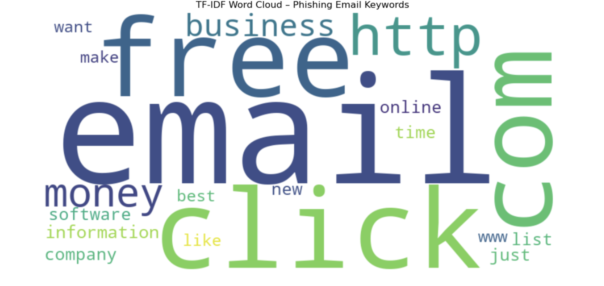
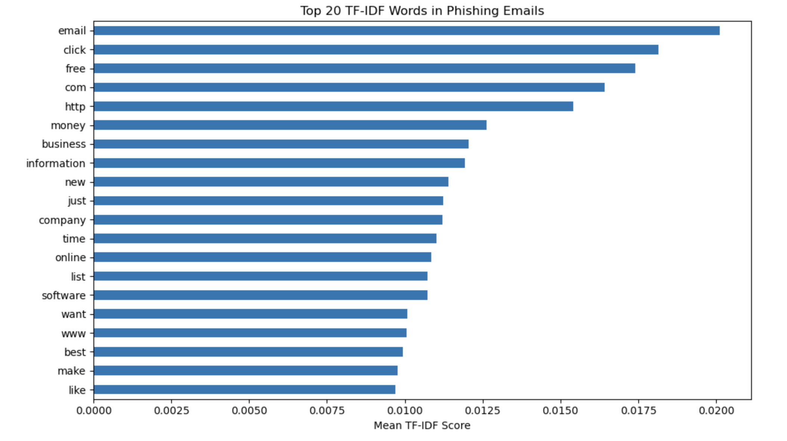

# Phishing Email Detection using NLP & Logistic Regression

A machine learning project focused on detecting phishing emails through Natural Language Processing (NLP) techniques. This project showcases not only technical implementation, but also critical thinking, storytelling, and practical cybersecurity applications.

---
## Table of Contents
- [Problem Statement](#-problem-statement)
- [Project Objectives](#project-objectives)
- [Data Cleaning & Preprocessing](#data-cleaning--preprocessing)
- [Feature Engineering: TF-IDF](#feature-engineering-tf-idf)
- [Model Building: Logistic Regression](#model-building-logistic-regression)
- [Baseline Evaluation](#baseline-evaluation)
- [Threshold Tuning for Business Impact](#threshold-tuning-for-business-impact)
- [TF-IDF Word Importance Visualization](#tf-idf-word-importance-visualization)
  - [Word Cloud](#word-cloud)
  - [TF-IDF Bar Chart](#tf-idf-bar-chart)
- [Business Applications](#business-applications)
- [Tools & Libraries](#tools--libraries)
- [Link to Code](#link-to-code)
---

## 📌 Problem Statement

Phishing emails remain a dominant vector for cyberattacks across industries. These fraudulent messages often trick recipients into clicking malicious links or sharing sensitive information. Detecting them in real-time is critical for preventing breaches.

**Key Question:**  
Can we build a reliable machine learning model that distinguishes phishing emails from safe ones using only the text content?

---

## Project Objectives

- Preprocess and clean real-world email text data
- Vectorize text using TF-IDF to capture word importance
- Train a classification model to detect phishing attempts
- Improve model sensitivity through probability threshold tuning
- Visualize key phishing words to enhance model interpretability

---

## Data Cleaning & Preprocessing

Raw email data often contains noise, missing values, and inconsistencies. I performed extensive cleaning to reflect real-world complexity:

- Dropped unnamed and unnecessary columns
- Renamed fields for clarity
- Removed rows with missing values
- Stripped special characters using regex
- Mapped target labels (`Phishing Email` → 1, `Safe Email` → 0)

```python
# Remove special characters
df_phishing['EmailText'] = df_phishing['EmailText'].str.replace(r'[^a-zA-Z0-9\s]', '', regex=True)
```

---

## Feature Engineering: TF-IDF

To capture meaningful patterns, I used **TF-IDF (Term Frequency–Inverse Document Frequency)** to transform text into numerical features:

- Eliminated common stopwords
- Limited high-frequency noise (`max_df=0.9`)
- Focused on signal words unique to phishing attempts

```python
vectorizer = TfidfVectorizer(stop_words='english', max_df=0.9)
X_train_vec = vectorizer.fit_transform(X_train)
```

---

## Model Building: Logistic Regression

I selected Logistic Regression for its interpretability and robustness with sparse text data. After splitting the data, the model achieved **96% accuracy** on the test set.

```python
model = LogisticRegression()
model.fit(X_train_vec, y_train)
```

---

## Baseline Evaluation

| Metric         | Safe Emails (0) | Phishing Emails (1) |
|----------------|-----------------|----------------------|
| **Precision**  | 0.95            | 0.97                 |
| **Recall**     | 0.98            | 0.93                 |
| **F1-Score**   | 0.97            | 0.95                 |

Interpretation:  
- High overall accuracy, but the recall for phishing could improve.  
- False negatives (phishing missed) are costly in security.

---

## Threshold Tuning for Business Impact

To prioritize catching more phishing emails, I adjusted the classification threshold from 0.5 → 0.3:

```python
y_probs = model.predict_proba(X_test_vec)[:, 1]
y_pred_threshold = (y_probs >= 0.3).astype(int)
```

### After tuning:
- **Recall for phishing = 1.00 (100%)**
- **Precision = 0.88** (some false positives accepted)

🎯 Business Insight:  
This is a safer tradeoff in cybersecurity, better to overflag than miss a phishing attempt.

---

## TF-IDF Word Importance Visualization

To explain what cues the model uses, I analyzed and visualized top words from phishing emails.

### Word Cloud

Words like **“click”**, **“free”**, **“money”**, and **“http”** are strong phishing indicators — aligning with known attack patterns.

### TF-IDF Bar Chart


---
## Business Applications

- Detect phishing in real-time email pipelines
- Explainable ML model supports trust and compliance
- Enrich cybersecurity rules using high TF-IDF keywords
- Improve user education based on flagged terms

---

## Tools & Libraries

- Python, Pandas, Scikit-learn, Matplotlib, WordCloud
- Jupyter Notebook
- TF-IDF Vectorization
- Logistic Regression with Threshold Optimization

---
## Link to Code
[Phishing Email Detection Code](PhishingEmailDetection_Formatted.ipynb)
